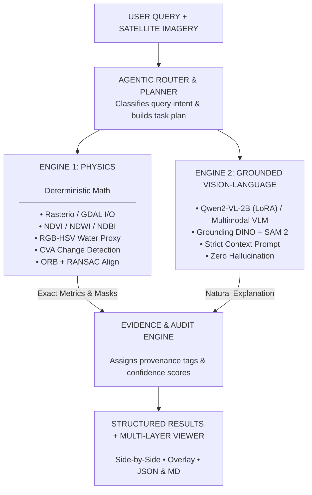

# SatQuery AI 🛰️

> **Multimodal Geospatial & Satellite Image Analysis Engine**  
> An intelligent decision-support system designed for automated scene reasoning, multispectral feature extraction, and grounded evidence reporting on Earth observation imagery.

---

## 📌 Architecture Overview

---

## 🚀 Key Features

* **Zero-Hallucination Design:** All physical quantities (percentages, surface areas, index averages) are computed by mathematical raster algorithms before the language model sees the prompt.
* **Hierarchical RGB Water Detection:** Solves the failure of traditional NDWI on 3-band RGB imagery (which lacks a true Near-Infrared band). Combines HSV spectral filtering (Hue 62°–145°), normalized absorption ratios, and connected-component spatial filtering to detect coastal lagoons and retention ponds while rejecting dark building shadows.
* **Bi-Temporal Change Analysis (CVA + Otsu):** Automatically registers Before/After image pairs using ORB feature matching and RANSAC homography, computes Euclidean Change Vector Analysis (CVA), and applies dynamic Otsu thresholding with morphological cleaning to extract changed terrain.
* **Land-Cover Classification:** Unsupervised MiniBatch K-Means clustering combined with Scharr gradient texture analysis and rule-based assignment across water, vegetation, built-up, bare soil, and other classes.
* **Object Localization & Grounding:** Open-vocabulary target detection using Grounding DINO and polygon segmentation using Segment Anything Model 2 (SAM 2) for identifying discrete objects (vehicles, storage tanks, ships, roads).
* **Scientific Honesty & Confidence Engine:** Transparently categorizes all output data into epistemological tiers (`OBSERVED`, `DERIVED`, `DETECTED`, `AI-DETECTED`) and dynamically scales confidence scores (e.g., from 100% down to 40%–60% when non-georeferenced RGB inputs are used).

---

## 🧭 Analytical Pipelines & Query Workflow

SatQuery AI enables operators to interact with complex geospatial rasters through plain-language text prompts. The platform automatically routes user queries through dedicated deterministic physics algorithms and domain-adapted vision-language pipelines.

| Pipeline & Input | Example Query | Deterministic & Vision Processing | Interactive Visualizer & Output |
| --- | --- | --- | --- |
| **Single-Scene Optical** 

 *(Sentinel-2 RGB / Multispectral)* | *"Describe the land cover and isolate water bodies in this scene."* | • Radiometric index calculation (NDVI, NDWI, NDBI) 

 • HSV spectral filtering & absorption ratios 

 • MiniBatch K-Means land-cover clustering | • **Interactive Layer Toggles:** Switch instantly between True Color (RGB), isolated Water, Vegetation vigor, and Land Cover masks. 

 • **Deterministic Cards:** Exact calculated surface fractions (no AI estimation). |
| **Bi-Temporal Change Pair** 

 *(T1 Baseline + T2 Target)* | *"What areas have changed between these two dates and quantify the shift?"* | • Automated feature co-registration (ORB + RANSAC) 

 • Change Vector Analysis (CVA) 

 • Dynamic Otsu thresholding & morphological filtering | • **Change Mask Highlighting:** Visually isolate zones of deforestation, urban expansion, or flood recession. 

 • **Difference Inspection Slider:** Split-view before/after comparison. 

 • **Shift Metrics:** Exact changed area in percentage and hectares/km². |
| **Cross-Modal SAR Fusion** 

 *(Sentinel-2 Optical + Sentinel-1 SAR)* | *"Penetrate cloud cover using radar backscatter to assess flood inundation."* | • Polarimetric backscatter analysis ($\sigma^0$ VV/VH) 

 • Multi-sensor spatial co-registration 

 • Joint spectral-structural feature fusion | • **All-Weather Structural View:** Visualizes ground features obscured by clouds or nighttime. 

 • **Moisture & Roughness Maps:** Distinguishes smooth open water from rough built infrastructure. |
| **Target Localization & Grounding** 

 *(Single Scene / Tile)* | *"Locate industrial storage tanks and coastal vessels."* | • Open-vocabulary grounding (Grounding DINO) 

 • Fine-grained polygon segmentation (SAM 2) 

 • High-reflectance amplitude filtering | • **Interactive Bounding Overlays:** Visual grounding boxes with semantic label tags. 

 • **Object Count & Coordinates:** Exact pixel centroids and bounding extents. |

---

### 🖥️ Interactive Results & Audit Trail

Every query execution delivers an end-to-end, multi-layered dashboard:

1. **Interactive Multi-Layer Canvas:**
* **True Color (RGB) Baseline:** Inspect the original calibrated satellite scene.
* **Dynamic Layer Switcher:** Selectively toggle between isolated water masks, vegetation index overlays, and classified land-cover segments on the fly.
* **Change Highlight Overlay:** In bi-temporal mode, immediately illuminate altered pixels with spatial difference highlights and split-slider comparisons.

2. **Deterministic Measurement Panel:**
* Ground-truth surface percentages and physical metrics computed mathematically directly from raster bands before reasoning occurs.

3. **Evidence-Grounded Interpretation:**
* The conversational VLM translates mathematical findings into clean technical summaries, referencing explicit **Evidence IDs** and execution trace logs for complete auditability.

4. **Structured One-Click Export:**
* **JSON Schema:** Machine-readable payload containing indices, coordinates, and classification arrays for GIS pipelines.
* **Markdown (.md) Report:** Formatted executive briefing ready for stakeholder review and distribution.

---

## 🛠️ Technology Stack

| Layer | Technology |
| --- | --- |
| **Frontend UI** | Next.js (React), Tailwind CSS, Lucide Icons |
| **Backend API** | FastAPI, Uvicorn, Pydantic |
| **Geospatial & Computer Vision** | Rasterio, OpenCV, NumPy, SciPy, Scikit-learn, Scikit-image, Shapely, Pillow (PIL) |
| **Vision & Reasoning Engine** | Qwen2-VL-2B (LoRA Domain Adapted) / Multimodal VLM, Grounding DINO, SAM 2 |
| **Export & Reporting** | Markdown Export Pipeline, Dynamic JSON Evidence Store |

---

## 📋 Development Progress

| Stage | Status | Description |
| --- | --- | --- |
| **Stage 1** | ✅ Complete | Core foundation — Rasterio pipeline, spectral indices, REST API endpoints, and dashboard UI |
| **Stage 2** | 🔄 In Progress | Multimodal VLM reasoning & zero-shot geospatial feature grounding |
| **Stage 3** | ⏳ Planned | Full agentic tool execution with custom segmentation overlays |

