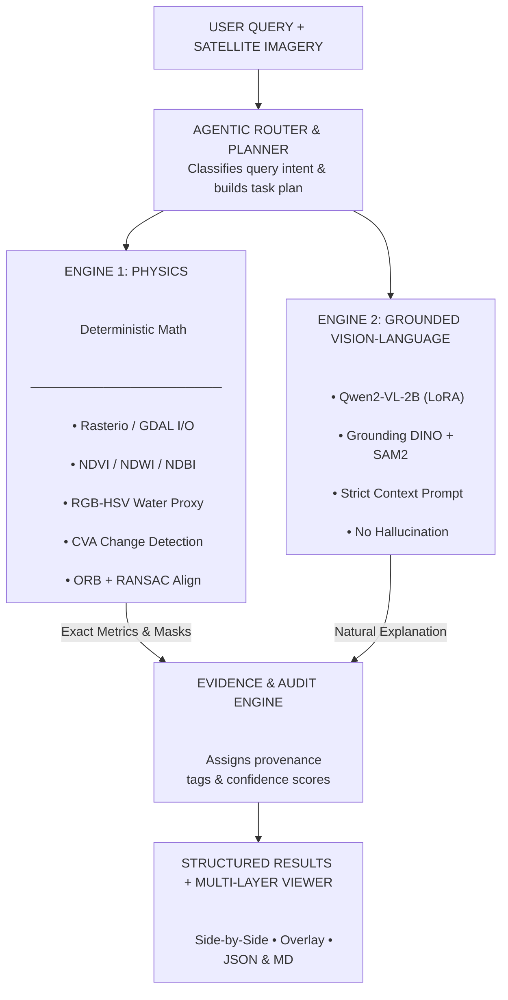

# SatQuery AI 🛰️

> **Multimodal Geospatial & Satellite Image Analysis Engine**  
> An intelligent decision-support system designed for automated scene reasoning, multispectral feature extraction, and grounded evidence reporting on Earth observation imagery.

---

## 📌 Architecture Overview


---

## 🚀 Key Features

* **Zero-Hallucination Design:** All physical quantities (percentages, surface areas, index averages) are computed by mathematical raster algorithms before the language model sees the prompt.
* **Hierarchical RGB Water Detection:** Solves the failure of traditional NDWI on 3-band RGB imagery (which lacks a true Near-Infrared band). Combines HSV spectral filtering (Hue 62°–145°), normalized absorption ratios, and connected-component spatial filtering to detect coastal lagoons and retention ponds while rejecting dark building shadows.
* **Bi-Temporal Change Analysis (CVA + Otsu):** Automatically registers Before/After image pairs using ORB feature matching and RANSAC homography, computes Euclidean Change Vector Analysis (CVA), and applies dynamic Otsu thresholding with morphological cleaning to extract changed terrain.
* **Land-Cover Classification:** Unsupervised MiniBatch K-Means clustering combined with Scharr gradient texture analysis and rule-based assignment across water, vegetation, built-up, bare soil, and other classes.
* **Object Localization & Grounding:** Open-vocabulary target detection using Grounding DINO and polygon segmentation using Segment Anything Model 2 (SAM 2) for identifying discrete objects (vehicles, storage tanks, ships, roads).
* **Scientific Honesty & Confidence Engine:** Transparently categorizes all output data into epistemological tiers (`OBSERVED`, `DERIVED`, `DETECTED`, `AI-DETECTED`) and dynamically scales confidence scores (e.g., from 100% down to 40%–60% when non-georeferenced RGB inputs are used).

---

## 🛠️ Technology Stack

| Layer | Technology |
| --- | --- |
| **Frontend** | Next.js (React), Tailwind CSS, Lucide Icons |
| **Backend API** | FastAPI, Uvicorn, Pydantic |
| **Geospatial Processing** | Rasterio, Shapely, Pillow (PIL) |
| **Vision & Reasoning** | Google Gemini Multimodal API (`gemini-1.5-flash`) |
| **Export & Reporting** | Markdown Export Pipeline, Dynamic JSON Evidence Store |

---

## 📋 Development Progress

| Stage | Status | Description |
| --- | --- | --- |
| **Stage 1** | ✅ Complete | Core foundation — Rasterio pipeline, spectral indices, REST API endpoints, and dashboard UI |
| **Stage 2** | 🔄 In Progress | Multimodal VLM reasoning & zero-shot geospatial feature grounding |
| **Stage 3** | ⏳ Planned | Full agentic tool execution with custom segmentation overlays |

---

## ⚡ Quickstart Guide

### 1. Backend Setup

```bash
cd backend
python -m venv .venv
# On Windows:
.venv\Scripts\activate
# On Linux/macOS:
source .venv/bin/activate

pip install -r requirements.txt
uvicorn app.main:app --reload --port 8000

```

### 2. Frontend Setup

```bash
cd frontend
npm install
npm run dev

```

Open [http://localhost:3000](http://localhost:3000?utm_source=gemini) in your browser.

```

---

