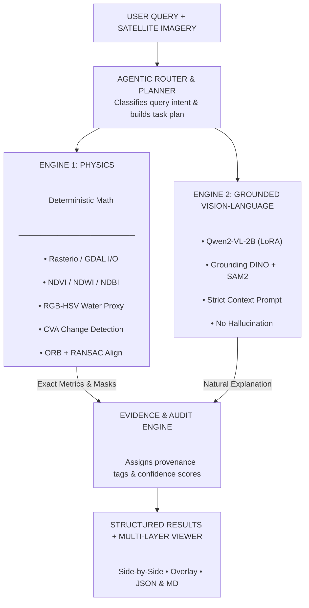

# SatQuery AI 🛰️

> **Multimodal Geospatial & Satellite Image Analysis Engine**  
> An intelligent decision-support system designed for automated scene reasoning, multispectral feature extraction, and grounded evidence reporting on Earth observation imagery.

---

## 📌 Architecture Overview


---

## 🚀 Key Features

* **Multispectral & Optical Processing:** Automated extraction of land cover fractions (Vegetation, Built-up Proxy, Water, Bare Soil) using spectral indices.
* **Multimodal Visual Grounding:** Integrates visual-language capabilities for natural follow-up inspection and object localization within scenes.
* **Audit-Grade Evidence Tracking:** Generates structured session records and confidence metrics for geospatial verifiability.
* **Flexible Report Exporting:** Instant generation of executive reports in Markdown (`.md`), structured JSON, and client-side printable formats.
* **Modern Geospatial Dashboard:** High-contrast, responsive dark UI built with Next.js and Tailwind CSS.

---

## 🛠️ Technology Stack

| Layer | Technology |
| --- | --- |
| **Frontend** | Next.js (React), Tailwind CSS, Lucide Icons |
| **Backend API** | FastAPI, Uvicorn, Pydantic |
| **Geospatial Processing** | Rasterio, Shapely, Pillow (PIL) |
| **Vision & Reasoning** | Google Gemini Multimodal API (`gemini-1.5-flash`) |
| **Export & Reporting** | Markdown Export Pipeline, Dynamic JSON Evidence Store |

---

## 📋 Development Progress

| Stage | Status | Description |
| --- | --- | --- |
| **Stage 1** | ✅ Complete | Core foundation — Rasterio pipeline, spectral indices, REST API endpoints, and dashboard UI |
| **Stage 2** | 🔄 In Progress | Multimodal VLM reasoning & zero-shot geospatial feature grounding |
| **Stage 3** | ⏳ Planned | Full agentic tool execution with custom segmentation overlays |

---

## ⚡ Quickstart Guide

### 1. Backend Setup

```bash
cd backend
python -m venv .venv
# On Windows:
.venv\Scripts\activate
# On Linux/macOS:
source .venv/bin/activate

pip install -r requirements.txt
uvicorn app.main:app --reload --port 8000

```

### 2. Frontend Setup

```bash
cd frontend
npm install
npm run dev

```

Open [http://localhost:3000](http://localhost:3000?utm_source=gemini) in your browser.

```

---

